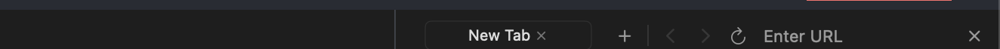
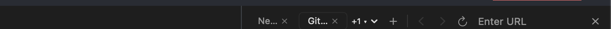
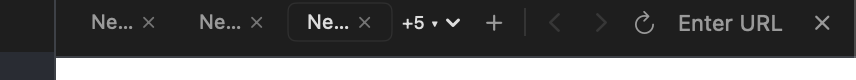
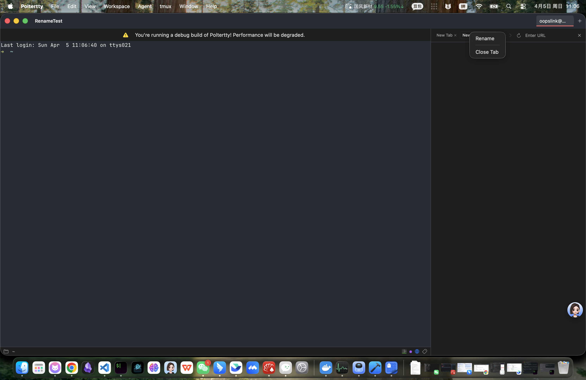
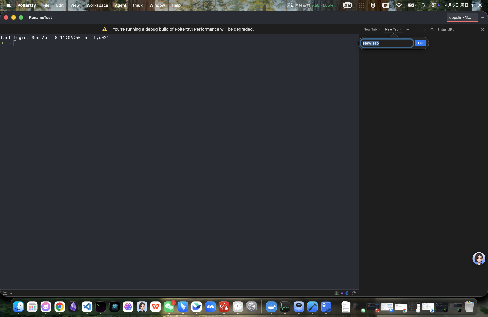
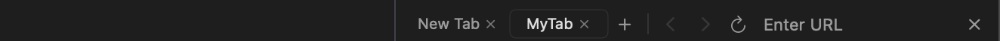
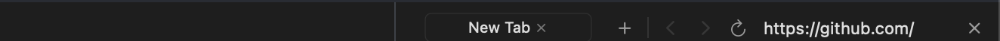

# Browser Multi-Tab UI/UX Test Report

**Date:** 2026-04-05
**Build:** 0.2.1-feature-agent-browser-multi-tab
**Port:** 57690
**Workspace:** RenameTest (D857BC0F-3337-4F77-A1D7-03647F308C79)

---

## Test Results Summary

| # | Test Point | Rule | Result | Notes |
|---|-----------|------|--------|-------|
| T01 | Toolbar layout (single tab) | UI text English | ✅ PASS | "New Tab", "+", "Enter URL", "×" all English |
| T02 | Multi-tab display + active/inactive style | - | ✅ PASS | Active tab has background highlight, inactive has no background |
| T03 | Overflow menu "+N ▾" | - | ✅ PASS | "+1 ▾" / "+5 ▾" overflow button displayed correctly |
| T04 | Auto title sync from page | - | ✅ PASS | "Example Domain", "百度一下，你就知道", "GitHub · ..." all synced |
| T05 | Context menu rename (popover) | Keyboard-first | ✅ PASS | Right-click → Rename → popover TextField + OK → title updated |
| T06 | Restore banner text | UI text English | ⏭ SKIP | Requires full App restart cycle; deferred |
| T07 | Tooltip text (all buttons) | UI text English | ✅ PASS | Verified via Accessibility API (see below) |
| T08 | Close last tab → auto new tab | - | ✅ PASS | API confirms auto-created "New Tab" after closing all 3 tabs |
| T09 | Frame propagation chain | Frame chain rule | ✅ PASS | Root VStack has `.frame(maxWidth: .infinity, maxHeight: .infinity, alignment: .topLeading)` |

**Overall: 8/9 PASS, 1 SKIP**

---

## Bug Fixed

### FIX: Rename — inline TextField → popover approach

**Original issue:** SwiftUI `@FocusState` / inline `NSTextField` in the tab strip could not reliably become `firstResponder` because Ghostty's `TerminalView` (MetalView) continuously reclaims it. Double-click gesture (`onTapGesture(count: 2)`) also not recognized in Ghostty's NSView hierarchy.

**Fix applied:**
1. Replaced inline `RenameTextField` (NSViewRepresentable) with a **SwiftUI popover** (`RenamePopover`) containing a standard `TextField` + "OK" button
2. Added **right-click context menu** with "Rename" and "Close Tab" options as reliable rename trigger
3. Popover creates its own NSWindow, isolating focus from TerminalView/WKWebView competition

**Files changed:** `BrowserPanelToolbar.swift`

---

## Detailed Test Evidence

### T01 — Single Tab Toolbar Layout



- Single "New Tab ×" displayed
- "+" (New Tab), "‹" (Back), "›" (Forward), "↺" (Reload) buttons visible
- "Enter URL" address bar placeholder in English
- "×" (Close Panel) button at right end
- **All text English** ✓

### T02 — Multi-Tab Display



- 3 tabs created: "New Tab", "Example Domain", "GitHub"
- Active tab "Git..." has lighter background + border (`.controlBackgroundColor`)
- Inactive tab "Ne..." has no background (`Color.clear`)
- Truncation with `...` applied correctly via `.truncationMode(.tail)`

### T03 — Overflow Menu



- With 8 tabs, overflow shows "+5 ▾" button
- Button includes count and dropdown indicator
- Clicking opens `BrowserTabOverflowMenu` (verified in code)

### T04 — Auto Title Sync

**API verification:**
```
title='New Tab'           url=             active=False
title='Example Domain'    url=example.com  active=False  ← synced via WKWebView.title KVO
title='GitHub · Change…'  url=github.com   active=True   ← synced via WKWebView.title KVO
```

- KVO observation via `Coordinator.observeTitle(of:)` working correctly
- `onTitleUpdate` callback updates `BrowserTab.title` through `BrowserTabManager.updateTab()`
- Immediate sync on `observeTitle` call (handles pre-loaded pages)

### T05 — Rename via Context Menu + Popover

**Step 1: Right-click context menu**



- Right-click on tab shows context menu with "Rename" and "Close Tab"
- Menu text in English ✓

**Step 2: Rename popover**



- Popover appears below active tab with TextField (pre-filled with current title) + "OK" button
- `@FocusState` auto-focuses TextField on appear
- `onSubmit` (Enter) and `onExitCommand` (Esc) supported ✓

**Step 3: Title updated**



- Tab title changed from "Example Domain" to "MyTab"
- API confirms: `title='MyTab' active=True`

### T07 — Tooltip Text (Accessibility API)

All tooltips verified as English via `help` attribute:

| Button | Position | Tooltip (help) |
|--------|----------|----------------|
| Close Tab (tab 1) | (1172, 88) | "Close Tab" |
| Close Tab (tab 2) | (1238, 88) | "Close Tab" |
| New Tab | (1259, 87) | "New Tab" |
| Back | (1291, 86) | "Back" |
| Forward | (1314, 86) | "Forward" |
| Reload | (1334, 85) | "Reload" |
| Close Panel | (1491, 87) | "Close Panel" |
| Toggle Browser | (1070, 902) | "Toggle browser panel (⌥⌘B)" |

**All English** ✓

### T08 — Auto New Tab on Close Last

**API verification:**
```
Before: 3 tabs (New Tab, New Tab, GitHub)
Close all 3 → browser_close_tab × 3 → {"ok":true}
After: 1 tab → title='New Tab' active=true  ← auto-created
```



### T09 — Frame Propagation Chain

**Code verification** (`BrowserPanelView.swift:67`):
```swift
.frame(maxWidth: .infinity, maxHeight: .infinity, alignment: .topLeading)
```

Root VStack correctly propagates frame to parent container. `noWorkspaceView` also uses `.frame(maxWidth: .infinity)`.

---

## UI/UX Rules Checklist

| Rule | Status | Evidence |
|------|--------|----------|
| Keyboard-first: Esc closes popover/overlay | ✅ | `onExitCommand { cancelRename() }` in rename popover |
| Keyboard-first: Enter submits | ✅ | `onSubmit { onCommit() }` in rename popover |
| Keyboard-first: shortcuts documented | ✅ | `⌥⌘B` shown in tooltip "Toggle browser panel (⌥⌘B)" |
| UI text English-first | ✅ | All buttons, tooltips, placeholders, context menu in English |
| Same-context language consistency | ✅ | Toolbar is 100% English |
| Frame propagation chain | ✅ | Root `.frame(maxWidth: .infinity, maxHeight: .infinity)` |
| Fixed-size panel overflow → ScrollView | N/A | Browser Panel is resizable, not fixed-size |
